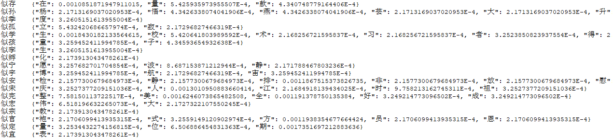
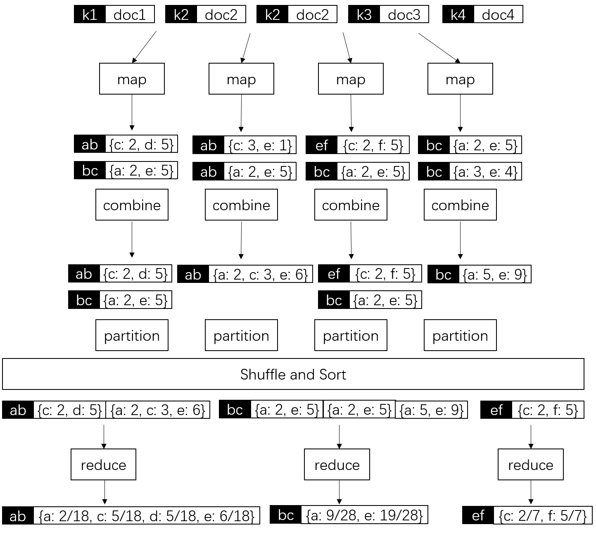

## 分布式系统PJ 实验报告

姓名：罗旭川             学号：17307130162             日期：2020.12.22

#### 一、任务说明与描述

* 目的：利用 `MapReduce` 框架构建 `Trigram Language Model`
* 具体：
  * 利用大于2G的`Sohu News`中文语料计算 `P(W3|W1 W2)`
  * 加入`Smoothing`
  * 实现汉字输入预测

#### 二、程序启动与操作说明

##### 1. Trigram Language Model 训练程序

* 将`TrigramLM/out/artifacts/TrigramLM_jar/TrigramLM.jar` 放入装有`hadoop`的机器中

* 执行 `hadoop jar TrigramLM.jar [集群中的输入文件地址] [集群中语言模型输出地址]` 命令开始训练

  * 集群中的输入地址为：`/corpus/news_sohusite.xml`，即2G的`Sohu News`中文语料
  * 输出地址可自定义，如`output`

* 训练时间大约 `50分钟` （包含两个`Job`）

* 输出结果形式：

  

  即通过两个`W1 W2` 来预测的 `P(W3|W1 W2)` 的概率（这里的数值经过了Smoothing，因此比较小）。

##### 2. 汉字输入预测程序

* 后端

  * 进入`WordPredict/backend`目录

  * 将训练完成的语言模型放在`./output` 中

    * 由于模型比较大因此上传在百度云上：

      链接：https://pan.baidu.com/s/1VvY9WgRYrkz2eTQMyglHEg  提取码：ogy8 

  * 执行 `python Backend.py` 文件启动后端
    
    * 由于要读取模型，启动较慢请耐心等待

* 前端

  * 打开 `WordPredict/dist/index.html`，往输入框输入文字即可

* 预测效果

  

#### 三、程序文件/类功能说明

##### 1. Trigram Language Model 训练程序

* `TrigramLM.java`

  总的入口程序，会先后执行两个Job，第一个Job是用于计算语料库大小（字种数）的`PreJob`（用于进行Smoothing），第二个Job是计算 `P(W3|W1 W2)`的主Job.

* `TrigramLMMap.java`

  **Map阶段**：用`Strips`的方法实现对`trigram` 子串个数的统计

  |      | key                      | value                                            |
  | ---- | ------------------------ | ------------------------------------------------ |
  | 输入 | 文本偏移量               | 一对<doc></doc>标签内的段落内容，即对应一条news  |
  | 输出 | 长度为2的前缀串，如 "ab" | 前缀的下一个字符的出现个数的map，如 {c: 2, d: 5} |

* `TrigramLMCombiner.java`

  **Combine阶段**：将values中key值相同的部分合并，以加快网络传输

  如：将 `ab -> {c: 2, d: 5}`  和 `ab -> {c: 1}` 合并为 `ab -> {c: 3; d: 5}`

* `TrigramLMReduce.java`

  **Reduce阶段**：先和Combine阶段一样，把values中key值相同的部分相加合并，然后转化为概率，并进行Smoothing。

  |      | key                      | value                                                     |
  | ---- | ------------------------ | --------------------------------------------------------- |
  | 输入 | 长度为2的前缀串，如 "ab" | map阶段输出的value的列表，如 [{c: 2, d: 5, ...}, ...]     |
  | 输出 | 长度为2的前缀串，如 "ab" | 前缀的下一个字符的出现概率的map，如 {c: 0.1, d: 0.4, ...} |

* `MyMapWritable.java`

  这是 `MapWritable`  的一个子类，重载了其中的 `toString()` 方法，以实现自定义的输出格式。

* `/Util`

  * `XmlInputFormat.java`

    这个是 `maout` 提供的一个 `InputFormat` 类，可以将输入的`xml`文件按照指定的`tag`进行切片、输入。项目中指定的`tag`为`<doc><doc/>`，因此切分出的每一个输入正好对应一条news。

  * `XMLParser`

    `xml` 解析类，对由`XmlInputFormat.java`输入的输入字符串（每一条news）进行进一步解析，抽取出news的标题和内容，即每一条news的`<contenttitle><contenttitle/>` 和 `<content><content/>` 中的内容。因为只有这两个内容里是我们需要的中文语料。

* `/PreJob`

  简单的词数统计的Job。这里最终通过`Counter`来计数，从而得到整个语料库中的字的种数，并传递给前面的主Job，以用来实现Smoothing。

  * `WordCount.java`
  * `WordCountMap.java`
  * `WordCountReduce.java`

##### 2. 汉字输入预测程序

简单的用于demo的前后端应用，不是本项目的重点，因此不详细叙述。

* `WordPredict/src`：前端代码，通过`vue`前端框架编写
* `WordPredict/backend`： 后端代码，通过`python` 编写
* `WordPredict/backend/output`： 由前面的训练程序训练出的语言模型

#### 四、架构以及模块实现方法说明

##### 1. Trigram Language Model 训练程序

* **map模块**实现方法

  1. 先调用`XMLParser`类从输入的一条news的XML串中提取出该news的标题和内容两段，以此排除掉其它无关信息的语言模型训练的干扰。
  2. 对于要处理的中文字符串，遍历它上面所有的三元子串，然后用一个`HashMap`来记录各种前缀打头的不同三元子串的个数。如对于一个子串`abc`，则记录为 `ab -> {c: 1}`；若再次发现一个相同的子串，则更新为`ab -> {c: 2}`。
  3. 将`HashMap` 中的键值对逐条发送到下一模块

* **combine模块**实现方法

  将收到的所有相同的key的对应的value值（为map类型）进行合并，如将 `ab -> {c:3, e:1}`和 `ab -> {a: 2, e: 5}` 合并为 `ab -> {a: 2, c: 3, e: 6}`，以此加快传输效率。

* **partition模块**实现方法

  用框架中默认的、通过hash来实现的partition方法即可，因为这种方法已经足够保证同一个key值得键值对输入到相同的一个reduce。

* **reduce模块**实现方法

  1. 将收到的所有相同的key的对应的value值（为`MapWritable`类型）进行合并

  2. 同时计算出每个key值对应的下一个字符的总数 `sum`，通过将对应的`MapWritable`中的所有值相加得出。

  3. 通过 `sum` 值来将`MapWritable`中的值转化为概率：

     $$P(W_3|W_1 W_2)=\frac{P(W_1W_2W_3)}{P(W_1W_2)}=\frac{Count(W_1W_2W_3)}{Count(W_1W_2)}=\frac{Count(W_1W_2W_3)}{sum}$$

  4. 通过`PreJob` 中计算出的语料库大小`V`来进行 `Smoothing`：

     $$P(W_3|W_1W_2)=\frac{P(W_1W_2W_3)+k}{P(W_1W_2)+kV},\ \ k为超参$$

     简单起见，使用 $$P(W_3|W_1W_2)=\frac{Count(W_1W_2W_3)+1}{sum+V}$$

##### 2. 汉字输入预测程序

* 前端界面实现方法

  前端界面就一个输入框，通过监听用户的输入。当用户进行输入时，将用户当前输入的最后两个字符作为参数，向后端请求预测的下一个字符的列表。

* 后端接口实现方法

  1. 后端在启动时读取整个语言模型，并将对于每一个前缀的预测`HashMap`转化为按照概率从大到小排列的下一个字符的列表。这样当接收到前端的请求后，只需要将对应的下一个字符的列表发送回前端即可。

  2. 为了加快传输效率，这里将返回的列表大小限制为了完整列表的前20个。

#### 五、总结

通过这次项目，我基本掌握了`MapReduce` 程序的编写方法，对`MapReduce`的整个流程也有了比较细致的了解。另一方面，还学习了三元语言模型的相关知识，并动手进行了实现，预测效果良好。另外，还深刻感受了`MapReduce`编程过程中`debug`的麻烦。
